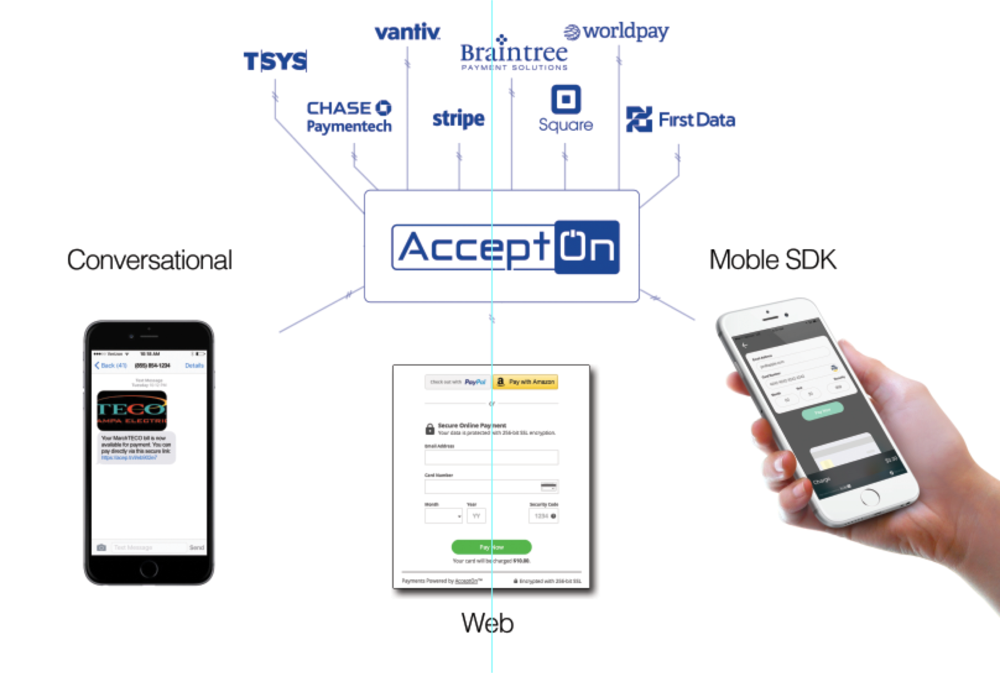

#Overview

## About AcceptOn

*AcceptOn* is a service that allows you to **deploy payments anywhere, across any provider, with one integration**.

AcceptOn supports a variety of [payment processors](./#payment-processors), e.g. *Stripe*, *PayPal*, via one of our simple payment forms. This allows you to accept 
payments in all your platforms with the least amount of code, in a native idiom, and in the most elegant fashion.

Additionally, after using one of our simple payment forms to integrate into your desired platform, transactions
are aggregated for all [payment processors](./#payment-processors) into one simple backend API.  You may choose to have your own servers
collect this information ([See Dynamic Kit](./#dynamickit)) for verification purposes or to commit actions such as sending a purchased item.

## Getting Started

There are only a few steps to getting started.  You may have completed these steps during the onboarding procedures.

  1. [Setting up your payment processors](./#payment-processors)
  2. [Setting up a payment form on a website or native app](./#payment-forms)
  3. [Optionally, configure DynamicKit on your own servers](./#dynamickit)

# Payment Processors

## Dashboard Configuration

*Payment processors* are configured on your AcceptOn dashboard under the **Payment Processors** tab. 
You may have already configured a payment processor during the onboarding procedures. 

#### An example of what you will see on your dashboard:

Please go to the **Payment Processors** page on your dashboard for individualized
instrutions on how to configure each payment processor.

## Supported payment processors

Currently, we provide support for the following payment processors:

<table style='width: 80%'>
<tr>
<td style='padding: 0;'>
 
 
 
</td>
</tr>

<tr style='border-bottom-color: rgba(0, 0, 0, 0);'>
<td style='padding: 0;'>
 
 
</td>
</tr>
</table>

#### Additionally, our iOS Payment Form SDK contains support for ApplePay.

## Processing Credit Cards
<table>
<tr style='border-bottom-color: rgba(0, 0, 0, 0);'>
<td style='width: 100px'>

</td>

<td>
<em>All payment processors are capable of processing credit-cards</em> and may have the ability
to process a special payment as-well.  For example, the <em>PayPal</em> and <em>PayPal
REST</em> both provide the ability to process credit-card numbers or alternatively, use the
traditional <em>PayPal</em> checkout experience with login information.

</td>
</tr>
</table>

### Multiple payment processors

If you have multiple payment processors enabled, you will need to select which payment
provider is used as the *default credit-card* payment processor. Even if you enable an
SDK like PayPal with a login-like checkout flow, the AcceptOn payment forms will allow
the user the option of either clicking *Checkout with PayPal* or enter credit-card
information.

#### Credit cards will be processed through this processor:

# Payment Forms

## Introduction

Payment forms are the *front-end* used to accept payments in AcceptOn. The payment forms come in several flavors:

  * Web/HTML5 Edition
  * iOS Native Edition

### Web/HTML5 Edition
The Web/HTML5 edition of the payment forms allows you to embed an inline form or modal popup in your website.

##### [Get started with the Web/HTML5 edition](./#setting-up-a-new-payment-form)

### iOS Native Edition
The iOS native edition of the payment forms allows you to request payment in your native app through a beatiful
predesigned payment interface. Like the web counterpart, the iOS native version dyanmically updates the available
payment methods based on your enabled payment processors. 

##### [Get started with the iOS native edition]()

## Setting up a new payment form

Inside your [dashboard](https://accepton.com/admin/dashboard), the *Payment Forms* tab contains instructions on how to set-up payment forms
for both the *Web/HTML5* edition and *iOS native* editions.

#### Payment Forms Tab

## Web Payment Form Configuration
<table>
<tr style='border-bottom-color: rgba(0, 0, 0, 0);'>
<td style='width: 100px;'>

</td>

<td>
To view a listing of all options with the HTML form configurations, see:
<a href='./guides/form_configuration.html' class='btn'>Advanced HTML Form Configuration</a>
</td>
</tr>
</table>

<h1 id='dynamickit' class='hidden'>DynamicKit</h1>

DynamicKit is for your server personal backend.  This kit isn't required to process payments in AcceptOn, but you do need *DynamicKit* for things such as:

### Examples where you might need DynamicKit
  - Generating transaction tokens dynamically
  - Verify that a charge completed and for the correct amount
  - List and search charges
  - Refunding a charge dynamically
  - Create, read, and list plans dynamically
  - Cancel, retrieve, and list subscriptions dynamically
  - Modify promotional codes dynamically

<a href='./guides/dynamic_kit.html' class='btn btn-tall'><i class='dynamic-kit-icon'></i>Get Started with DynamicKit</a>

### Looking for the complete API Docs?

<table>
<tr style='border-bottom-color: rgba(0, 0, 0, 0);'>
<td style='width: 100px;'>

</td>

<td>
To view the complete <em>REST</em>ful API for the DynamicKit, along with all API calls for supported languages, see:
<a href='./guides/dynamic_kit_full_api.html' class='btn'><i class='api-icon'></i>DynamicKit API Reference</a>
</td>
</tr>
</table>

